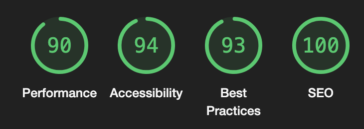

# Welcome to ShikiSphere - Anime Search and Shortlist App 👋

### Live Demo

https://shikisphere.vercel.app/

### Lighhouse Score

### Overview

This project is a simple, maintainable, modular, and scalable web application built with Next.js 14 and React 18. The application integrates with the Shikimori API to allow users to perform searches, display results in a visually appealing format, and shortlist items using client-side storage.

#### Key features include:

- Integration with the Shikimori API for anime search functionality (https://shikimori.one/api/doc/1.0/animes/index).
- A user-friendly UI for browsing and shortlisting search results.
- Mobile responsiveness and modular, maintainable code practices.
- Light/Dark mode toggle and optional pagination for enhanced usability.

### Setup Instructions

1. Clone the repository from `git@github.com:kanan88/shikisphere.git`
2. Run `npm install`
3. Run `npm run dev` to start the development server

### Key Features

- Search anime using Shikimori API
- Shortlist anime using local storage
- Responsive UI with Tailwind CSS and Shadcn
- Pagination

## Features

### Core Functionality

- Search Integration
  - Fetch data from the Shikimori API based on user input.
  - Display search results in a structured, visually appealing format.
- Shortlisting
  - Allow users to save items to a shortlist using localStorage for persistence.
  - Provide a dedicated section to manage shortlisted items.
- Responsive Design
  - Fully responsive and mobile-friendly interface.
- State Management
  - Use React's Context API for effective state management of shortlisting.

## Key Decisions and Trade-offs

#### 1. Next.js for Framework

- Chosen for its server-side rendering (SSR) capabilities, SEO benefits, easy routing, out-of-box integration with TailwindCSS and TypeScript and clear logical folder structure.

#### 2. State Management

- Used Context API for simplicity and to avoid over-engineering with external libraries like Redux for the simple case as Shortlisting.

#### 3. CSS Framework and Shadcn

- Tailwind CSS was used for rapid styling and customization.

#### 4. Pagination

- Added pagination to improve user experience for large datasets.

#### 5. Testing Scope

- Focused on some components due to time constraints, though broader test coverage is a goal for future iterations.
